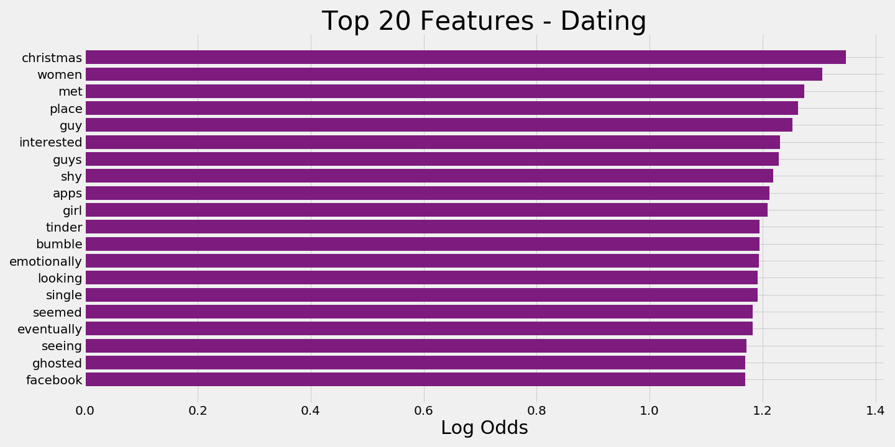
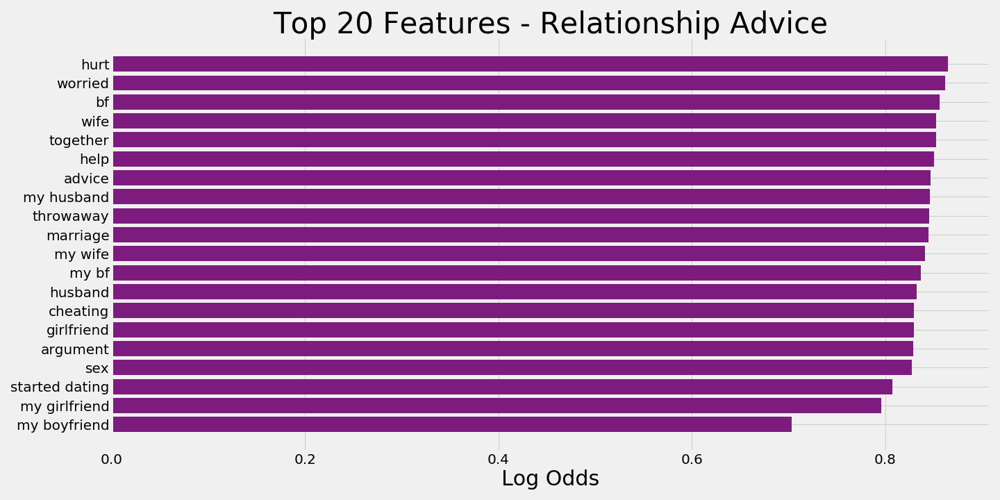

# Project 3 - Classifying Dating and Relationship Advice Subreddits
---
## Problem Statement:

**Through natural language processing and classification models, how can we classify texts based on the differences in words used by people who are looking to date and people who are in relationships? Furthermore, how can sentiment analysis be utilized to detect rocky relationships, and what ideas can be implemented to encourage user interaction while preventing relationships from going downhill?**

As [40%](https://www.eharmony.com/online-dating-statistics/) of Americans use online dating, using mobile apps and websites have increasingly become a mainstream method in meeting significant others. According to [Statistic Brain Research Institute](https://www.datingadvice.com/online-dating/online-dating-statistics), 20% of current committed relationships in 2018 started online, and 17% of couples who married within the last year met on a dating website. Once individuals find a match on their apps, they tend to leave the apps and continue their conversations via text messages. As more individuals are using online apps, companies should explore viable options to increase user interaction by offering online assistance to couples struggling with their relationships. Companies can implement a sentiment analysis over the messages exchanged between couples to detect key words that indicate a problematic relationship. 

---
## Executive Summary:

Compared to the baseline accuracy score of 54% of classifying posts whether they are from the relationship advice or dating subreddit, the best classification model is the logistic classification model which returned an accuracy score of 82%. The model performed better than multinomial naive bayes model and random forest classifier. 

The words that increase the likelihood of a particular post to be from the dating subreddit are:

The words that increase the likelihood of a particular post to be from the relationship advice subreddit are:

---
## Background:

By utilizing natural language processing algorithms, I want to investigate the submissions in two subreddits:

1. [Dating Subreddit](https://www.reddit.com/r/dating)
2. [Relationship Advice Subreddit](https://www.reddit.com/r/relationship_advice)

The Dating subreddit is an online forum in which there are 65 thousand subscribers, known as 'redditors', who are encouraged to share stories and vent about their dating experiences. The Relationship Advice subreddit is similar but there is a larger user base with 1.4 million subscribers. Furthermore, the subreddit reaches a broader audience where individuals can seek help for not only romantic relationships, but also familial, work-related, and friend-related relationships. Submissions in the relationship advice subreddit tend to gravitate towards more dire situations in which individuals are in a more serious and long term relationship than individuals in the dating subreddit and are asking for help in order to salvage a relationship. Though each individual predicament is incomparable, as a whole, people have more to lose in the relationship advice subreddit compared to the dating subreddit.

**Demographic**
As a whole, Reddit is home to 1.2 million subreddits. According to [Tech Junkie](https://www.techjunkie.com/demographics-reddit/#Subreddit_Use), 69% of the population are male and 65% of the population are white non-hispanic adults. Since the majority of the users are white males, there may be a skew in the perspective of subreddit posts and responses when they are seeking advice.

**Process**
1. A Reddit PushShift API will be used to scrape 10,000 text submissions from each subreddit. 
2. The text submissions will then be split into train and test datasets. The classification models will be built with the train datasets and the test datasets will be used to validate the model's accuracy for classifying unseen data.
3. After splitting, the texts will be vectorized (transformed into numbers) through either a Count Vectorizer or TF-IDF in order for the computer to perform Natural Language Processing
4. The following classification models, the logistic regression classifier, multinomial naive bayes, and random forest classifier, will be fitted to the vectorized dataset and return an accuracy score.

## Conclusions and Recommendations
---
**Part 1:**

| Model | Train Accuracy | Test Accuracy | AUC ROC | True Positive | True Negative | False Positive | False Negative |
|---|---|---|---|---|---|---|---|
| Logistic Classification | 87% |  82% |  90% |2015 | 2320 | 535 | 392 |  
| Multinomial Naive Bayes | 83% |  81% | 89% | 1889 | 2370 | 485 | 418 |
| Random Forests | 99% | 80% | 87% | 1789 | 2399 | 456 | 618 |
    
Based on the test accuracy and AUC ROC scores, it appears the logistic classification model performed the best out of the three. Furthermore, there is easier interpretability in logistic model's feature weights, and the model is not as overfit as the random forest and only slightly more overfit compared to the multinomial naive bayes. However, if we ignore the feature weight interpretability and purely focus on the classification process, the multinomial naive bayes model would be the best choice.

## Next Steps
---

I should gather more data by scraping more posts from both subreddits to lower overfitting and create a more robust classification model. Furthermore, time permitting, I would have covered more hyperparameter options in a `GridSearchCV` rather than a `RandomSearchCV` model fitting process in order to thoroughly search all hyperparameter combinations when fitting a model.